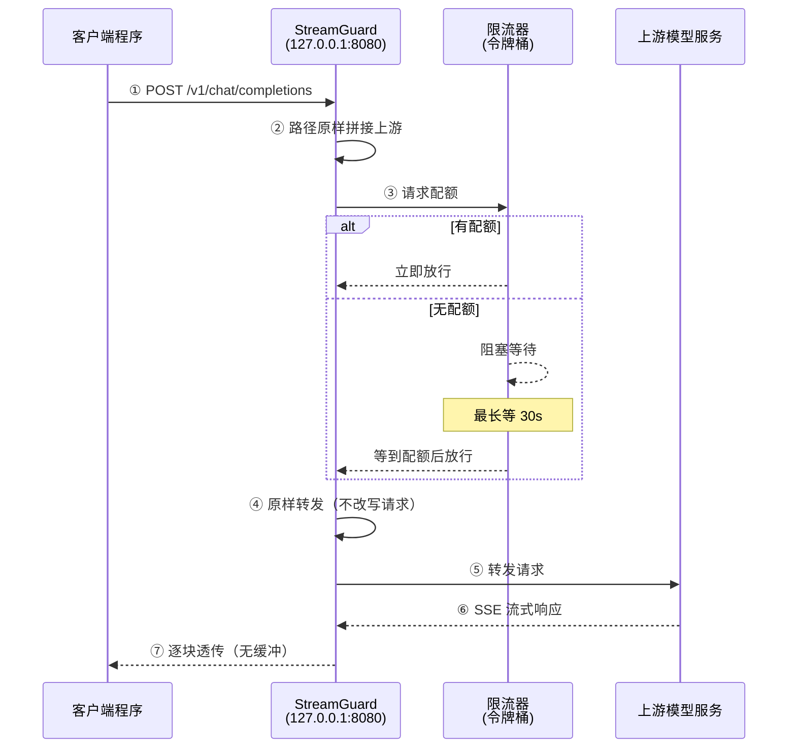

# 全链路请求示例

本文档完整展示一个请求从客户端发出到收到响应的全过程。

## 链路总览



## 详细步骤

### ① 客户端发起请求

客户端把原本指向上游的地址改为本地代理地址：

```bash
curl -N http://127.0.0.1:8080/v1/chat/completions \
  -H "Content-Type: application/json" \
  -H "Authorization: Bearer <your-api-key>" \
  -d '{
    "model": "your-model-name",
    "messages": [
      {"role": "user", "content": "用一句话介绍 Go 语言"}
    ],
    "stream": true
  }'
```

**要点**：
- 地址是 `127.0.0.1:8080`（本地代理），不是上游地址
- **需自行携带 `Authorization` 头**，StreamGuard 不做凭据注入
- `stream: true` 启用 SSE 流式输出

### ② 路径拼接

StreamGuard 不做路径改写，直接把请求路径拼接到 `upstream` 后转发：

| 客户端请求路径 | 处理 |
|---|---|
| `/v1/chat/completions` | ✅ 转发到 `upstream/v1/chat/completions` |
| `/model/v1/chat/completions` | ✅ 转发到 `upstream/model/v1/chat/completions` |
| `/healthz` | 本地健康检查（不转发） |
| `/stats` | 本地统计信息（不转发） |

> 因此客户端只需把 base_url 指向本地代理，其余路径保持不变。

### ③ 限流等待（核心环节）

这是 StreamGuard 的核心价值。以 `rate=1, burst=1`（1 秒 1 次）为例：

**场景 A：有可用配额**

```
请求到达 → 令牌桶有令牌 → 立即扣减 → 放行
耗时：< 1ms
```

**场景 B：配额耗尽**

```
请求到达 → 令牌桶为空 → 计算等待时间 → 阻塞
         ↓
    等待 1 秒（令牌补充）
         ↓
    获得令牌 → 放行
耗时：约 1000ms
```

**场景 C：等待超时**

```
请求到达 → 令牌桶为空 → 需要等待 60 秒
         ↓
    超过 max_wait（30s）
         ↓
    返回 429
```

**实测效果**（连续 3 个请求，`rate=1/s`）：

| 请求 | 耗时 | 说明 |
|---|---|---|
| 请求 1 | 210ms | 立即通过（210ms 为网络往返） |
| 请求 2 | 696ms | 等待约 0.5s |
| 请求 3 | 901ms | 等待约 1s |

> 日志中可见耗时递增，证明排队等待生效。

### ④ 转发到上游

StreamGuard **不修改请求内容**，客户端请求头与请求体**原样转发**（仅补充 `X-Forwarded-For` 便于上游排查）：

```http
POST https://your-upstream/base-path/v1/chat/completions
Authorization: Bearer <客户端自带的凭据>
Content-Type: application/json
Accept: text/event-stream
X-Request-Id: <客户端自定义头，原样透传>
X-Forwarded-For: 127.0.0.1

{"model":"your-model-name","messages":[...],"stream":true}
```

> - 客户端需自行携带 `Authorization` 头，StreamGuard 不做凭据注入。
> - 所有客户端请求头（含自定义头）均原样透传；`Host` 默认改写为上游主机名，可用 `preserve_host=true` 保留原始值。
> - 逐跳头（`Connection`、`Keep-Alive` 等）按 HTTP 规范移除。

### ⑥ SSE 流式响应

上游返回 SSE 流：

```
data: {"id":"chatcmpl-1","choices":[{"delta":{"content":"Go"}}]}

data: {"id":"chatcmpl-1","choices":[{"delta":{"content":" 是"}}]}

data: {"id":"chatcmpl-1","choices":[{"delta":{"content":"一门"}}]}

data: {"id":"chatcmpl-1","choices":[{"delta":{"content":"语言"}}]}

data: [DONE]

```

### ⑦ 逐块透传

StreamGuard 使用 `FlushInterval = -1` **关闭所有缓冲**，每个 SSE 分块到达即刻转发：

```
上游产生分块 → StreamGuard 立即转发 → 客户端立即收到
```

**为什么重要**：若开启缓冲，客户端会等到全部生成完才收到内容，失去流式体验。

**验证方法**：观察首块到达时间。若首块在 100ms 内到达（而非等全部生成完），说明未缓冲。

## 完整示例：Python 客户端

```python
import requests
import json

def chat_stream(prompt: str):
    """通过 StreamGuard 调用大模型，流式输出。"""
    resp = requests.post(
        "http://127.0.0.1:8080/v1/chat/completions",
        headers={"Content-Type": "application/json"},
        json={
            "model": "your-model-name",
            "messages": [{"role": "user", "content": prompt}],
            "stream": True,
        },
        stream=True,
        timeout=180,
    )

    if resp.status_code == 429:
        print("请求过于频繁，请稍后重试")
        return

    resp.raise_for_status()

    for line in resp.iter_lines():
        if not line:
            continue
        line = line.decode("utf-8")
        if not line.startswith("data: "):
            continue
        data = line[6:]
        if data == "[DONE]":
            break
        chunk = json.loads(data)
        delta = chunk["choices"][0].get("delta", {})
        if "content" in delta:
            print(delta["content"], end="", flush=True)

    print()


if __name__ == "__main__":
    chat_stream("用一句话介绍 Go 语言")
```

## 完整示例：OpenAI SDK 兼容

StreamGuard 完全兼容 OpenAI 协议，可直接用官方 SDK：

```python
from openai import OpenAI

client = OpenAI(
    base_url="http://127.0.0.1:8080/v1",  # 指向本地代理
    api_key="your-api-key",                # 需自行提供，代理不注入
)

stream = client.chat.completions.create(
    model="your-model-name",
    messages=[{"role": "user", "content": "你好"}],
    stream=True,
)

for chunk in stream:
    if chunk.choices[0].delta.content:
        print(chunk.choices[0].delta.content, end="", flush=True)
```

## 错误响应

### 429 限流超时

```http
HTTP/1.1 429 Too Many Requests
Content-Type: application/json
Retry-After: 1

{
  "error": {
    "message": "请求过于频繁，等待限流配额超时，请稍后重试",
    "type": "rate_limit_exceeded",
    "code": "rate_limit_exceeded"
  }
}
```

### 502 上游不可达

```http
HTTP/1.1 502 Bad Gateway
Content-Type: application/json

{
  "error": {
    "message": "上游服务不可达: dial tcp ...",
    "type": "upstream_error"
  }
}
```

### 404 路径不支持

```http
HTTP/1.1 404 Not Found
```

> 仅 `/v1/chat/completions` 被代理，其他路径一律 404。

## 时序说明

| 阶段 | 典型耗时 | 说明 |
|---|---|---|
| 路径拼接 | < 1ms | 内存操作 |
| 限流判定 | < 1ms | 有配额时 |
| 限流等待 | 0 ~ 30s | 无配额时，取决于速率配置 |
| 原样转发 | < 1ms | 内存操作 |
| 上游首字节 | 100ms ~ 数秒 | 取决于上游与模型 |
| SSE 透传 | 实时 | 无缓冲，逐块转发 |

## 调试技巧

### 查看实时统计

```bash
curl http://127.0.0.1:8080/stats
```

```json
{
  "upstream": "https://your-upstream/base-path",
  "rate": 1,
  "burst": 1,
  "total": 128,
  "waited": 96,
  "timed_out": 2,
  "canceled": 1,
  "avg_wait_ms": 412,
  "max_wait_ms": 1006,
  "min_wait_ms": 98,
  "breaker_enabled": false,
  "breaker_state": "closed",
  "breaker_trips": 0,
  "breaker_rejected": 0,
  "retry_enabled": false
}
```

- `total`：累计请求数
- `waited`：发生等待的请求数（`waited/total` 反映限流触发比例）
- `timed_out`：等待超时（返回 429）的请求数
- `canceled`：等待期间客户端取消的请求数
- `avg_wait_ms` / `max_wait_ms` / `min_wait_ms`：等待耗时统计（毫秒）
- `breaker_*`：熔断器状态（未启用时 `breaker_enabled=false`，其余为 0/closed）
- `retry_enabled`：上游限流重试是否启用

### 健康检查

```bash
curl http://127.0.0.1:8080/healthz
# {"status":"ok"}
```

### 观察日志

CLI 模式下日志直接输出到控制台；GUI 模式下显示在日志区：

```
10:55:33 [proxy] POST /v1/chat/completions client=127.0.0.1 耗时=210ms
10:55:34 [proxy] POST /v1/chat/completions client=127.0.0.1 耗时=696ms
10:55:35 [proxy] POST /v1/chat/completions client=127.0.0.1 耗时=901ms
```

耗时递增即表示限流等待生效。
