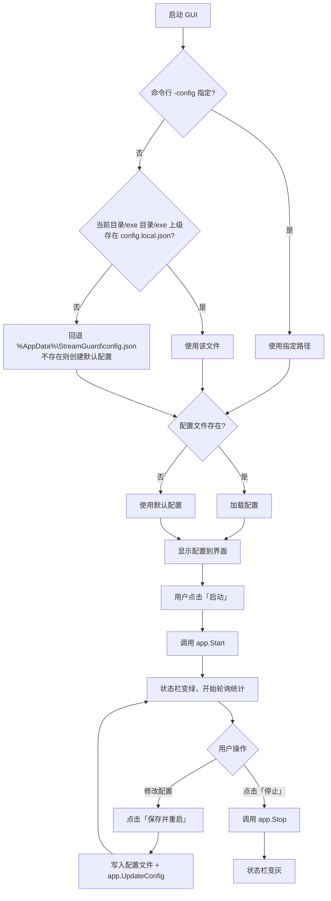

# 界面设计

StreamGuard 提供两种使用形态：**桌面 GUI**（Wails）与**命令行 CLI**，二者共用同一套核心逻辑。
本文是**唯一的界面设计文档**，以最新已实现样式为准（2026-09 完成的 UI 重设计已并入本文）。

## 形态对比

| 形态 | 可执行文件 | 适用场景 | 依赖 |
|---|---|---|---|
| **桌面 GUI** | `streamguard-gui.exe` | 桌面双击使用，图形化配置 | 系统 WebView2（Win10+ 内置） |
| **命令行 CLI** | `streamguard.exe` | 服务器、脚本、无界面环境 | 无 |

> 两者功能等价，GUI 只是 CLI 的可视化外壳。配置格式完全一致，可互相切换。

## 架构

```
┌─────────────────────────────────────────────────────┐
│                    用户界面层                         │
│  ┌──────────────────┐      ┌──────────────────┐    │
│  │  GUI (Wails)     │      │  CLI (flag)      │    │
│  │  HTML/CSS/JS     │      │  命令行参数       │    │
│  └────────┬─────────┘      └────────┬─────────┘    │
│           │  绑定调用                │  直接调用     │
│           └───────────┬─────────────┘               │
├───────────────────────┼─────────────────────────────┤
│                       ▼                             │
│              internal/app（核心层）                  │
│        启动 / 停止 / 改配置 / 查状态                  │
├─────────────────────────────────────────────────────┤
│  ┌──────────┐ ┌──────────┐ ┌─────────┐ ┌────────┐  │
│  │ config   │ │ limiter  │ │ proxy   │ │ server │  │
│  │ 配置加载  │ │ 限流等待  │ │ 反向代理 │ │ HTTP   │  │
│  └──────────┘ └──────────┘ └─────────┘ └────────┘  │
└─────────────────────────────────────────────────────┘
```

**设计要点**：`internal/app` 是唯一的核心层，GUI 与 CLI 都通过它操作服务，避免逻辑重复。

## 设计理念

### 产品的本质

StreamGuard 是一个**常驻后台的代理工具**。用户与它的关系分两个阶段：

| 阶段 | 频率 | 用户心智 |
|---|---|---|
| **配置期** | 一次性（装好后填一次） | “我要把它跑起来” |
| **运行期** | 每天/每次使用 | “请求都正常通过了吗？有没有被限流？” |

**核心洞察**：用户 95% 的时间处于运行期，因此**主视图 = 运行状态与流量**，配置只在需要时出现。

### 三条设计原则

1. **主视图 = 运行状态与流量**。配置收进独立视图（点 ⚙ 切换），只在需要时出现。
2. **主操作与状态绑定**。启停按钮永远紧邻状态指示，单按钮切换，绝不分离。
3. **每个操作都有回声**。保存、启动、失败必须有即时、明确的反馈；禁止“点了没反应”。

### 对标产品的经验萃取

以顶级桌面工具（Proxyman、Charles、Linear、Raycast、VS Code）为基准：

| 产品 | 值得学的 | StreamGuard 的取舍 |
|---|---|---|
| Proxyman | 流量列表是主视图；点统计即过滤 | ✅ 采纳：统计卡片可点击过滤日志（待后端结构化） |
| Charles | 系统托盘常驻 + 托盘快捷操作 | ✅ 采纳（待做） |
| Linear | 键盘优先、快捷键无处不在、动效克制 | ✅ 采纳快捷键；动效仅用于状态切换 |
| Raycast | 命令面板、空状态即引导 | ✅ 采纳空状态引导；命令面板列为可选 |
| VS Code Settings | 改动即生效、搜索配置 | ⚠️ 不采纳自动保存——配置需显式提交生效 |
| Postman | dirty 状态提示 + 常驻保存 | ✅ 采纳 |

**刻意不做**（防止功能膨胀，守住“零依赖”红线）：

- 请求/响应内容查看器——那是调试器的领域，不是限流代理的
- 第三方图表库——sparkline 用纯 SVG 手绘
- 多 Profile 配置——等真实需求出现再做

## GUI 界面布局

### 主视图（运行期，高频）

```
┌────────────────────────────────────────────────────────────┐
│ 🛡️ StreamGuard  ● 运行中 · 2h13m ⧉  [■ 停止][🌓][⚙][ℹ] [—□×] │
├────────────────────────────────────────────────────────────┤
│ ┌──────────┐┌──────────┐┌──────────┐┌──────────┐      │
│ │ 累计请求   ││ 等待次数   ││ 当前速率   ││ 熔断状态   │      │
│ │   128     ││    96     ││  1.0/s    ││  正常     │      │
│ │  ▁▂▅▃▇▆▁  ││           ││ (sparkline)││           │      │
│ └──────────┘└──────────┘└──────────┘└──────────┘      │
│  代理地址 http://127.0.0.1:8080 （无流量时显示引导文案）          │
│  配置总览：本机 127.0.0.1:8080 → 上游…；限流 1 次/秒…（一句话）  │
├────────────────────────────────────────────────────────────┤
│ 日志  [全部▾][搜索…][☑自动滚动]                      [清空] │
│ 10:55:33  POST /model/v1/chat/completions  200  210ms      │
│ 10:55:34  ⚠ upstream 429, waiting 2.0s for retry          │
│ 10:55:35  ✕ breaker open, fast-fail 503                    │
│           （主区域，悬停冻结刷新，渲染上限 500 行）             │
├────────────────────────────────────────────────────────────┤
│ 配置文件：…config.local.json        详细日志：logs/…         │
└────────────────────────────────────────────────────────────┘
```

### 配置视图（点 ⚙ 进入，全屏切换）

> 原设计的“右侧抽屉”落地为**全屏视图切换**：实现更简单、窄窗更友好。

```
┌────────────────────────────────────────────────────────────┐
│ （同一顶栏）                                                 │
├────────────────────────────────────────────────────────────┤
│  配置   修改后需保存并应用…                                   │
│  ① 基础连接（upstream/listen/timeout，失焦即校验）            │
│  ② 限流  ③ 大请求并发🔛 ④ 熔断🔛 ⑤ 重试🔛 Ⓞ 日志(折叠)     │
├────────────────────────────────────────────────────────────┤
│  ● 未保存更改  [保存并应用][重新加载][返回主视图]  ←吸底常驻    │
└────────────────────────────────────────────────────────────┘
```

### 界面元素说明

| 区域 | 元素 | 说明 |
|---|---|---|
| **顶栏** | 状态 pill | `● 运行中 · 2h13m`，含运行时长；紧邻单按钮启停 |
| | 复制按钮 ⧉ | 一键复制代理地址（仅运行中显示），toast 反馈 |
| | 启停按钮 | `▶ 启动 ⇄ ■ 停止` 单按钮，带 loading 过渡态；启动失败（端口占用）toast 附「去修改端口」直达修复 |
| | 主题按钮 🌓 | 跟随系统/浅色/深色三态循环，localStorage 持久化 |
| | 齿轮 ⚙ | 切换到配置视图；首次运行（upstream 为空）自动进入并聚焦必填项 |
| | 关于 ℹ | 弹出「关于」对话框：应用名/组织（fhub）/版本号/License（原生模态，✕/遮罩/Esc 关闭；不写真实仓库地址等敏感域名） |
| **统计卡片** | 累计请求 | 内嵌 sparkline（最近 60 次采样的请求增量曲线，纯 SVG） |
| | 等待次数 / 当前速率 | 实时刷新 |
| | 熔断状态 | 未启用/正常/半开/⚠ 已熔断，颜色 + 文字双重区分 |
| | 代理地址 | 运行中显示实际监听地址 + 复制按钮；无流量时附引导文案 |
| | **配置总览** | 一句话说明当前**生效**的整体配置（路由、限流、超时、熔断/重试/大请求并发的启用态与关键参数）；由 `GetConfig` 组装，反映已保存配置而非表单草稿，保存后刷新。纯前端，无新配置项 |
| **配置视图** | 分组 ①–⑥ | 字段与旧版一致；主开关控制子参数禁用态 |
| | dirty 提示 | `● 未保存更改`；返回主视图时有未保存改动需确认，绝不静默丢弃 |
| | 字段校验 | 上游 URL 格式、监听地址端口范围、大小并发不同时为 0，失焦即红字提示 |
| **日志区** | 筛选器 | 级别下拉（全部/信息/警告/错误）+ 关键词搜索 + 「显示请求日志」开关 + 自动滚动开关 |
| | 逐请求基础信息 | 每个请求一行：`方法 路径 → 状态码 · 耗时`；chat 请求附模型名（`· gpt-4o-mini`）与**请求体（输入）大小**，所有请求附**响应体（输出）大小**（`· 请求 12.3KB · 响应 4.5KB`，`formatBytes` 转 B/KB/MB，SSE 为各块之和），命中限流排队时附「排队」标记（默认显示，可关） |
| | 行着色 | info/debug/warn/error 分级配色，请求行按状态码归档（≥500→error、429/≥400→warn、其余→info），warn/error 附 ⚠/✕ 徽标（不依赖单一颜色） |
| | hover 冻结 | 鼠标悬停时暂停重绘，移开后补渲染 |
| **快捷键** | Ctrl+S / Ctrl+R | 保存配置 / 启停切换 |
| **底部** | 路径信息 | 配置文件与实际日志文件路径展示 |

## 交互设计要点

### 启停控制（顶栏控制中心）

- **单按钮切换**：`▶ 启动` ⇄ `■ 停止`，颜色随语义（绿/红），紧邻状态 pill。
- **过渡态**：点击后按钮进入 loading（图标转圈 + 禁用），后端返回后才切换状态，杜绝“点了没反应”。
- **状态 pill 信息**：`● 运行中 · 2h13m`，运行时长让用户确认“它一直在工作”。
- **代理地址一键复制**：地址旁 `[⧉]` 图标，点击复制并 toast「已复制」——最高频的复制需求，一键完成。
- **启动失败直达修复**：端口占用是最高频错误，失败 toast 附「去修改端口」按钮，点击自动进入配置视图并聚焦监听地址（**错误 → 修复 ≤ 2 次点击**）。

### 配置视图

- **入口**：顶栏齿轮 ⚙（配置参数是本产品核心价值，可发现性优先，不藏角落）。
- **dirty 感知**：任意字段变更即显示 `● 未保存更改`；保存按钮常驻吸底且高亮。
- **关闭保护**：有未保存改动返回主视图 → `confirm` 确认，绝不静默丢弃。
- **保存反馈**：运行中 → toast「已保存，代理已用新配置重启」；未运行 → toast「已保存，下次启动生效」。
- **字段级即时校验**：URL 格式、端口范围、“小/大请求并发不能同时为 0”等，失焦即红字，不等保存。
- **首次运行向导**：检测到 upstream 为空 → 自动进入配置视图、必填项高亮，解决新用户“然后呢？”的激活断层。

### 统计卡片（洞察，不只是数字）

- **sparkline**：累计请求卡片内嵌最近 60 次采样的请求增量曲线（纯 SVG，无依赖）。
- **空状态引导**：运行中但累计请求为 0 时，卡片区域替换为引导文案：「将你的客户端指向 http://127.0.0.1:8080 即可开始」+ 复制按钮。
- **统计-日志联动**（待做）：429 卡片、熔断卡片可点击下钻过滤日志，需 `GetLogs` 返回结构化状态码后补齐。

### 日志区（主视图）

- **逐请求基础信息**：每个代理请求写入一行基础信息（方法/路径/状态码/耗时，命中限流排队时附「排队」标记），
  chat 路径（`/chat/completions`）额外提取**模型名**与**请求体（输入）字节数**；**所有请求**统计**响应体（输出）字节数**（由 `statusRecorder` 在 `Write` 累计，SSE 为全部数据块之和）。均以 `请求 X / 响应 Y` 标注区分输入输出，`formatBytes` 转 KB/MB 展示。
  由 `internal/app` 的请求钩子上报，**仅含大小/模型等基础元信息（模型名属请求体顶层字段，响应仅计字节数），不含请求体与响应体正文**（符合开发规范第 9 节：详细日志不入面板）。
- **显示开关**：「显示请求日志」勾选框即点即生效（前端过滤 source=request 行），不新增配置项、无需重启。
- **筛选器**：级别下拉（全部/信息/警告/错误）+ 路径关键词搜索 + 自动滚动开关。
- **行着色与徽标**：warn/error 分级配色并附 ⚠/✕ 徽标，不依赖单一颜色（兼顾色弱）。
- **hover 冻结**：鼠标悬停日志区时暂停重绘，移开后补渲染——解决实时日志“永远看不清想看那行”的隐形痛点。
- **渲染上限**：保留最近 500 行，避免长跑内存膨胀。

### 全局体验

- **快捷键**：`Ctrl+S` 保存（不在配置页时自动切过去）、`Ctrl+R` 启停，均拦截浏览器默认行为。
- **路径可点击**（待做）：底部配置文件/日志路径，点击在资源管理器中定位（需 Go 侧绑定）。
- **系统托盘**（待做，需 Go 侧）：关闭窗口最小化到托盘，托盘菜单可启停。

## 主题系统（浅色 / 深色 / 跟随系统）

**为什么做**：用户群体不只有开发者，产品、测试、运营等岗位同样使用，且多倾向系统浅色。
**跟随系统 + 可手动覆盖**是 VS Code、Linear、Raycast 的共同答案，也是本产品的答案。

**设计要点**：

1. **三态选择器**：`跟随系统（默认） / 浅色 / 深色`，顶栏 🌓 图标点击循环切换。
2. **默认跟随系统**：首次启动用 `prefers-color-scheme` 探测；手动选择后记住偏好（localStorage，属界面偏好而非代理配置，不进 `config.json`）。
3. **CSS 变量是唯一色值来源**：`style.css` 全部色值走 `:root` 变量（`--bg`、`--panel`、`--accent` 等），禁止新增硬编码 hex；浅色主题只需覆盖一组变量：

   ```css
   :root { /* 深色（默认） */ --bg: #12141a; --panel: #1a1d26; ... }
   :root[data-theme="light"] { --bg: #f5f6f8; --panel: #ffffff; ... }
   ```

4. **无障碍对比度（WCAG AA）**：正文/背景对比度 ≥ 4.5:1，大字与图形 ≥ 3:1；次要文字提亮为 `--text-faint`；状态区分不只靠颜色（⚠/✕ 徽标 + 文字）。
5. **跟随系统实时切换**：监听 `matchMedia('(prefers-color-scheme)')` 变化，系统切换时界面即时跟随。

## 交互流程



> **配置查找与 CLI 一致**：优先使用仓库/程序目录下的 `config.local.json`，
> 仅当都找不到时才回退到用户配置目录。界面底部显示实际使用的配置文件路径。

## CLI 界面

### 启动输出

```
   _____ __             __  ______                     __
  / ___// /__________ _/ / / ____/___  __  ___________/ /
  \__ \/ __/ ___/ __ / / / / __/ __ \/ / / / ___/ __  /
 ___/ / /_/ /  / /_/ / / / /_/ / /_/ / /_/ / /  / /_/ /
/____/\__/_/   \__,_/_/  \____/\____/\__,_/_/   \__,_/

  Windows Local LLM API Rate-Limit Proxy  v0.2.0
2026/09/20 10:55:09 config file: config.local.json
2026/09/20 10:55:09 config loaded: listen=127.0.0.1:8080 upstream=https://xxx model=xxx rate=1.00/s burst=1 max_wait=30s
2026/09/20 10:55:09 [app] server started, listening on 127.0.0.1:8080
2026/09/20 10:55:09 rate limit: waiting mode, 1.00 req/s, burst 1, max wait 30s
2026/09/20 10:55:09 proxy address : http://127.0.0.1:8080
2026/09/20 10:55:09 upstream      : https://xxx
```

### 命令行参数

| 参数 | 说明 | 示例 |
|---|---|---|
| `-config` | 配置文件路径 | `-config config.local.json` |
| `-version` | 显示版本号 | `-version` |

### 退出

按 `Ctrl+C` 触发优雅关闭：

```
2026/09/20 11:00:00 received signal interrupt, shutting down gracefully...
2026/09/20 11:00:00 [app] server stopped
```

## 技术实现

### Wails 绑定接口

GUI 通过 Wails 绑定调用 Go 方法：

| 方法 | 说明 |
|---|---|
| `GetConfig()` | 获取当前配置 |
| `SaveConfig(cfg)` | 保存配置到文件 |
| `Start()` | 启动服务 |
| `Stop()` | 停止服务 |
| `Restart()` | 重启服务 |
| `GetStatus()` | 获取运行状态与统计 |
| `GetLogs()` | 获取日志（增量） |
| `ClearLogs()` | 清空日志 |
| `GetConfigPath()` | 获取配置文件路径 |
| `Minimize()` / `ToggleMaximize()` / `Quit()` | 窗口控制 |

### 前端技术栈

| 项 | 选型 | 说明 |
|---|---|---|
| 框架 | 原生 HTML/TS/CSS | 零框架；TS 模块拆分 main.ts / theme.ts / toast.ts / about.ts，vite 构建 |
| 样式 | 手写 CSS | 双主题（深色默认 + 浅色），色值全部走 `:root` CSS 变量，禁止硬编码 |
| 通信 | Wails Runtime | `window.go.main.App.*` |
| 轮询 | `setInterval` | 每秒刷新状态与日志 |

> 选择原生前端而非 Vue/React，是为了**减少构建复杂度**，界面本身不复杂。

### 构建

```bash
# 开发模式（热重载）
wails dev

# 构建生产版（产物由 scripts/build.ps1 复制到仓库根目录）
wails build -platform windows/amd64
```

## 实施进度

**已完成（本轮 UI 重设计）**：

- [x] 单按钮启停移顶栏 + loading 过渡态；状态 pill 含运行时长
- [x] 配置全屏视图切换 + 吸底保存 + dirty 提示 + 关闭确认（不静默丢弃）
- [x] 保存/启动/失败 toast 反馈；端口占用错误 2 次点击内到达修复入口
- [x] 代理地址一键复制
- [x] 日志级别筛选 + 关键词搜索 + 自动滚动 + hover 冻结 + warn/error 着色徽标
- [x] 逐请求基础信息显示（方法/路径/状态码/耗时/排队标记，chat 请求附模型名+请求体大小，所有请求附响应体输出大小）+「显示请求日志」开关（后端钩子上报，无新配置项）
- [x] 首次运行引导（upstream 空自动进配置视图并聚焦）
- [x] 字段级即时校验；快捷键 Ctrl+S / Ctrl+R
- [x] sparkline（纯 SVG，零后端改动）；空状态引导
- [x] 主题三态（跟随系统/浅色/深色）+ localStorage 持久化 + matchMedia 实时跟随
- [x] 顶栏 ℹ 「关于」弹窗（组织 fhub + 版本 + License + 简介，零依赖原生模态）
- [x] `style.css` 无硬编码色值；两套主题正文对比度 ≥ 4.5:1（WCAG AA）

**待办**：

- [ ] 统计-日志联动下钻（429/熔断卡片点击过滤；需 `GetLogs` 返回结构化状态码）
- [ ] 单条日志展开详情、虚拟滚动（需后端配合）
- [ ] 系统托盘图标（最小化到托盘）
- [ ] 配置/日志路径点击在资源管理器中定位（需 Go 侧绑定）
- [ ] 开机自启

## 全链路测试要求

> GUI 改动虽是前端为主，但涉及 Wails 绑定、构建嵌入与运行时行为，必须按
> [development-guide 第 5 节](./development-guide.md) 全链路验证，不允许只看界面效果就提交。

标准五步：`go test ./... -count=1` → `go vet ./...` + `gofmt -l .`（输出为空）→
前端 `npm run lint` + `scripts/build.ps1`（GUI 必须用 wails build，`go build` 不嵌入前端资源）→
GUI + CLI 双端到端冒烟（`/healthz` 期望 `{"status":"ok"}`、`/stats` 返回限流统计）→
敏感信息扫描（必须无输出）。链路规则回归见 [test-rules.md](./test-rules.md)。

**文档同步（与代码同一提交）**：更新本文件界面布局/元素说明；`development-log.md` 追加决策与踩坑；
若新增绑定方法，`wailsjs/go/main/App.js` + `App.d.ts` + `models.ts` 三处同步。
