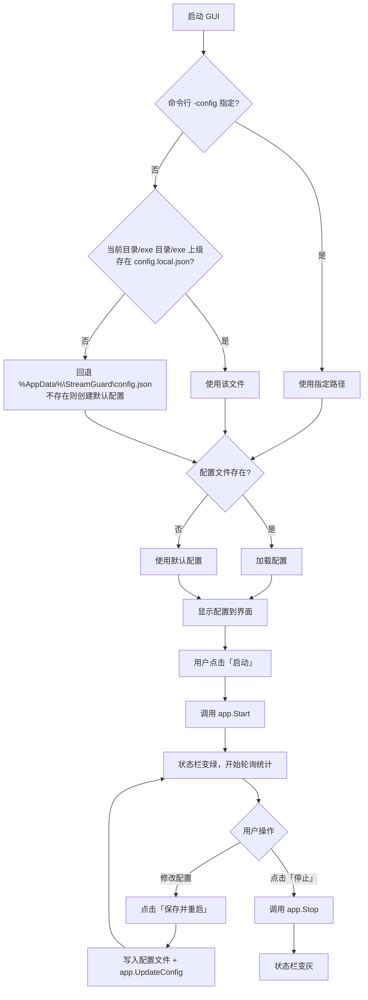

# 界面设计

StreamGuard 提供两种使用形态：**桌面 GUI**（Wails）与**命令行 CLI**，二者共用同一套核心逻辑。

## 形态对比

| 形态 | 可执行文件 | 适用场景 | 依赖 |
|---|---|---|---|
| **桌面 GUI** | `streamguard-gui.exe` | 桌面双击使用，图形化配置 | 系统 WebView2（Win10+ 内置） |
| **命令行 CLI** | `streamguard.exe` | 服务器、脚本、无界面环境 | 无 |

> 两者功能等价，GUI 只是 CLI 的可视化外壳。配置格式完全一致，可互相切换。

## 架构

```
┌─────────────────────────────────────────────────────┐
│                    用户界面层                         │
│  ┌──────────────────┐      ┌──────────────────┐    │
│  │  GUI (Wails)     │      │  CLI (flag)      │    │
│  │  HTML/CSS/JS     │      │  命令行参数       │    │
│  └────────┬─────────┘      └────────┬─────────┘    │
│           │  绑定调用                │  直接调用     │
│           └───────────┬─────────────┘               │
├───────────────────────┼─────────────────────────────┤
│                       ▼                             │
│              internal/app（核心层）                  │
│        启动 / 停止 / 改配置 / 查状态                  │
├─────────────────────────────────────────────────────┤
│  ┌──────────┐ ┌──────────┐ ┌─────────┐ ┌────────┐  │
│  │ config   │ │ limiter  │ │ proxy   │ │ server │  │
│  │ 配置加载  │ │ 限流等待  │ │ 反向代理 │ │ HTTP   │  │
│  └──────────┘ └──────────┘ └─────────┘ └────────┘  │
└─────────────────────────────────────────────────────┘
```

**设计要点**：`internal/app` 是唯一的核心层，GUI 与 CLI 都通过它操作服务，避免逻辑重复。

## GUI 界面布局

### 主窗口

```
┌────────────────────────────────────────────────────────┐
│  StreamGuard                                  [—][□][×] │
├────────────────────────────────────────────────────────┤
│  ● 运行中          监听 127.0.0.1:8080                  │
├────────────────────────────────────────────────────────┤
│                                                        │
│  ── 配置 ──────────────────────────────────────────    │
│                                                        │
│   上游地址   [ https://your-upstream/base-path    ]    │
│   [✓] 保留原始 Host 头                                 │
│                                                        │
│   限流速率   [ 1      ] 次/秒                          │
│   突发容量   [ 1      ]                                │
│   最大等待   [ 30s    ]                                │
│   请求超时   [ 120s   ]                                │
│                                                        │
│   监听地址   [ 127.0.0.1:8080                     ]    │
│   日志级别   [ info ▾ ]                                │
│                                                        │
│   [ 保存并重启 ]  [ 恢复默认 ]                          │
│                                                        │
├────────────────────────────────────────────────────────┤
│                                                        │
│  ── 运行状态 ──────────────────────────────────────    │
│                                                        │
│   ┌──────────┐  ┌──────────┐  ┌──────────┐            │
│   │  总请求   │  │  等待数   │  │  速率     │            │
│   │   128    │  │    96    │  │  1.00/s  │            │
│   └──────────┘  └──────────┘  └──────────┘            │
│                                                        │
│   代理地址: http://127.0.0.1:8080                      │
│                                                        │
├────────────────────────────────────────────────────────┤
│                                                        │
│  ── 日志 ──────────────────────────────────────────    │
│                                                        │
│   10:55:33  [proxy] POST /model/v1/chat/completions  210ms │
│   10:55:34  [proxy] POST /model/v1/chat/completions  696ms │
│   10:55:35  [proxy] POST /model/v1/chat/completions  901ms │
│                                                        │
│   [ 清空日志 ]  [ 自动滚动 ✓ ]                          │
│                                                        │
├────────────────────────────────────────────────────────┤
│  [ ▶ 启动 ]  [ ■ 停止 ]        配置: config.local.json │
└────────────────────────────────────────────────────────┘
```

### 界面元素说明

| 区域 | 元素 | 说明 |
|---|---|---|
| **状态栏** | 运行指示灯 | 绿色=运行中，灰色=已停止，红色=错误 |
| | 监听地址 | 显示实际监听地址（端口为 0 时显示真实端口） |
| **配置区** | 上游地址 | 上游模型服务基础地址，请求路径原样转发 |
| | 保留原始 Host 头 | 勾选后保留客户端原始 `Host`，不改写为上游主机名 |
| | 限流速率 | 每秒允许的请求数（QPS） |
| | 突发容量 | 允许瞬时通过的请求数 |
| | 最大等待 | 排队等待上限，超时返回 429 |
| | 请求超时 | 转发到上游的超时 |
| | 监听地址 | 本地监听地址 |
| | 日志级别 | debug / info / warn / error |
| **按钮** | 保存并重启 | 保存配置到文件并重启服务 |
| | 恢复默认 | 重置为默认配置（不自动保存） |
| **状态区** | 统计卡片 | 总请求 / 等待数 / 速率，实时刷新 |
| **日志区** | 日志列表 | 实时滚动，显示时间、方法、路径、耗时 |
| **底部** | 启动/停止 | 控制服务运行状态 |

### 交互流程



> **配置查找与 CLI 一致**：优先使用仓库/程序目录下的 `config.local.json`，
> 仅当都找不到时才回退到用户配置目录。界面底部显示实际使用的配置文件路径。

## CLI 界面

### 启动输出

```
   _____ __             __  ______                     __
  / ___// /__________ _/ / / ____/___  __  ___________/ /
  \__ \/ __/ ___/ __ / / / / __/ __ \/ / / / ___/ __  /
 ___/ / /_/ /  / /_/ / / / /_/ / /_/ / /_/ / /  / /_/ /
/____/\__/_/   \__,_/_/  \____/\____/\__,_/_/   \__,_/

  Windows Local LLM API Rate-Limit Proxy  v0.2.0
2026/09/20 10:55:09 config file: config.local.json
2026/09/20 10:55:09 config loaded: listen=127.0.0.1:8080 upstream=https://xxx model=xxx rate=1.00/s burst=1 max_wait=30s
2026/09/20 10:55:09 [app] server started, listening on 127.0.0.1:8080
2026/09/20 10:55:09 rate limit: waiting mode, 1.00 req/s, burst 1, max wait 30s
2026/09/20 10:55:09 proxy address : http://127.0.0.1:8080
2026/09/20 10:55:09 upstream      : https://xxx
```

### 命令行参数

| 参数 | 说明 | 示例 |
|---|---|---|
| `-config` | 配置文件路径 | `-config config.local.json` |
| `-version` | 显示版本号 | `-version` |

### 退出

按 `Ctrl+C` 触发优雅关闭：

```
2026/09/20 11:00:00 received signal interrupt, shutting down gracefully...
2026/09/20 11:00:00 [app] server stopped
```

## 技术实现

### Wails 绑定接口

GUI 通过 Wails 绑定调用 Go 方法：

| 方法 | 说明 |
|---|---|
| `GetConfig()` | 获取当前配置 |
| `SaveConfig(cfg)` | 保存配置到文件 |
| `Start()` | 启动服务 |
| `Stop()` | 停止服务 |
| `Restart()` | 重启服务 |
| `GetStatus()` | 获取运行状态与统计 |
| `GetLogs()` | 获取日志（增量） |
| `ClearLogs()` | 清空日志 |
| `GetConfigPath()` | 获取配置文件路径 |
| `Minimize()` / `ToggleMaximize()` / `Quit()` | 窗口控制 |

### 前端技术栈

| 项 | 选型 | 说明 |
|---|---|---|
| 框架 | 原生 HTML/CSS/JS | 零构建依赖，简单直接 |
| 样式 | 手写 CSS | 深色主题，紧凑布局 |
| 通信 | Wails Runtime | `window.go.main.App.*` |
| 轮询 | `setInterval` | 每秒刷新状态与日志 |

> 选择原生前端而非 Vue/React，是为了**减少构建复杂度**，界面本身不复杂。

### 构建

```bash
# 开发模式（热重载）
wails dev

# 构建生产版（产物由 scripts/build.ps1 复制到仓库根目录）
wails build -platform windows/amd64
```

## 后续扩展

- [ ] 系统托盘图标（最小化到托盘）
- [ ] QPS 实时曲线图（ECharts）
- [ ] 请求历史列表（可筛选、导出）
- [ ] 开机自启
